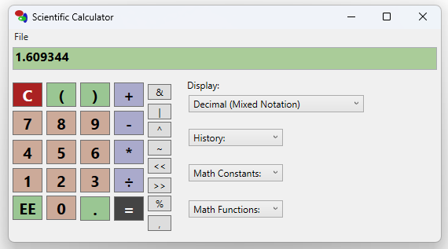
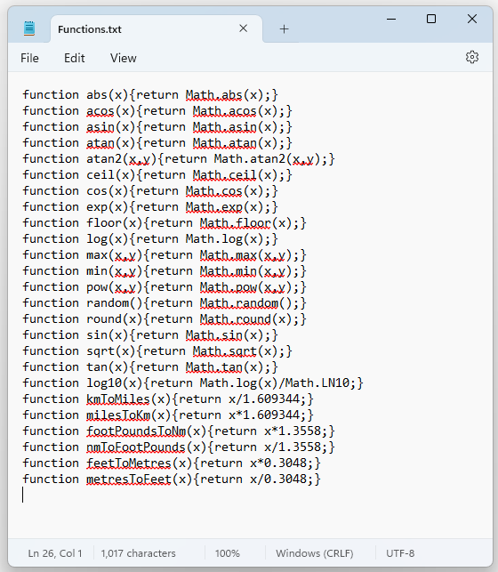
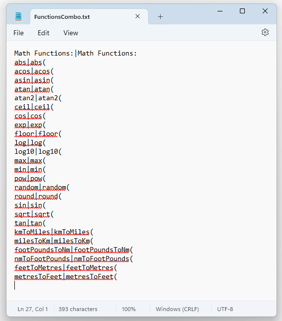

# ScientificCalculatorWpf
Wpf and WinUI3 Scientific Calculator, port of Stephen Ostermiller's html calculator (https://ostermiller.org/calc/calculator.html).
Check out the releases page to get the latest binaries for windows.

You can extend the functions available by editing the Functions.txt to add the javascript functions and FunctionsCombo.txt to extend the FunctionCombo box.

